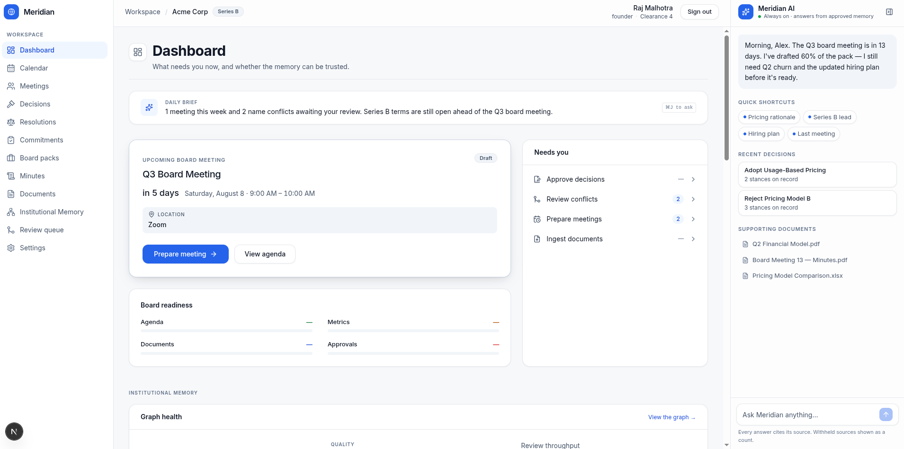
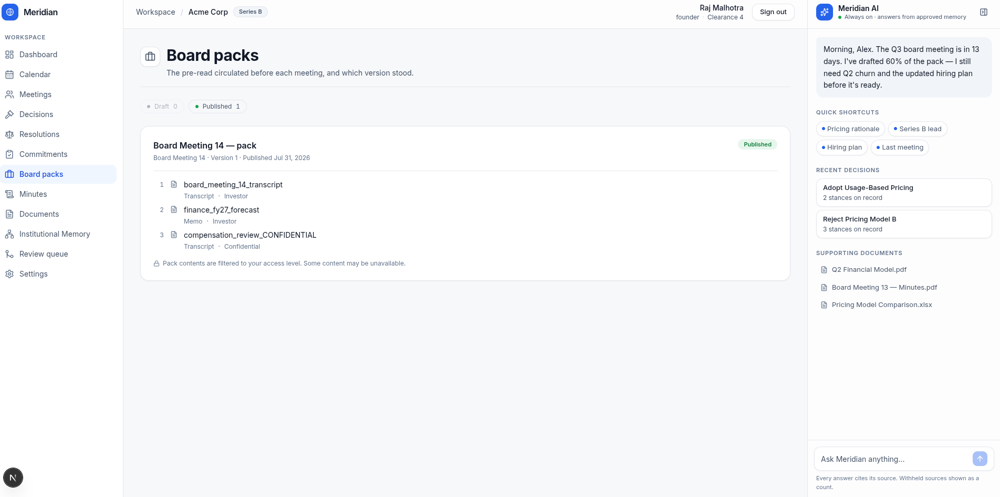
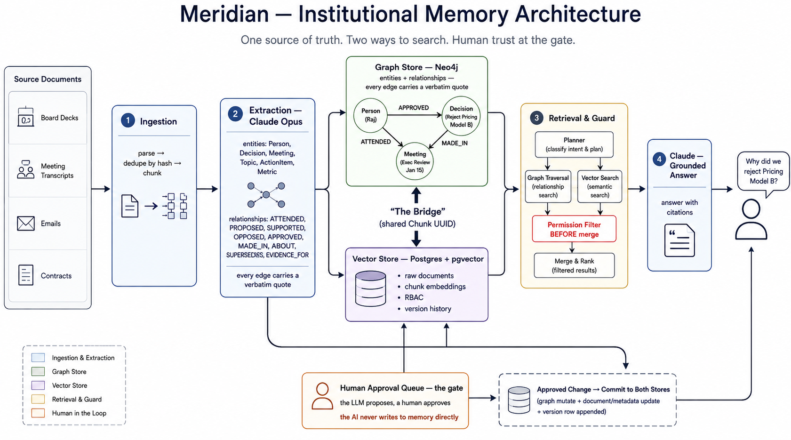

# Callosum — verified institutional memory

**An AI system that answers questions about an organisation's decisions and cannot
fabricate the answer.**

Every fact it surfaces carries a verbatim quote from a source document that a machine
located character-for-character. If the quote cannot be found in the source, the fact
never enters the system — it is quarantined, not stored.

> **"Why did we reject Pricing Model B?"**
>
> → who proposed it, who supported it, who opposed it, in which meeting, what the
> rationale was, what came out of it — each with the sentence that proves it.

Named for the *corpus callosum*, the fibre bundle joining the brain's hemispheres. This
system has two hemispheres — a knowledge graph and a vector store — and the bridge
between them is the whole idea.

---

## The measured claim

The graph is not decoration on a vector store. Its contribution is isolated by ablation,
holding the corpus, the questions and the traversal code constant:

| Configuration | Graph-fact recall on graph-dependent questions |
|---|---|
| Exact match only, no grounding | **38%** |
| Planner grounding enabled | **100%** |

And the evaluation says precisely *where* retrieval fails, which turned out not to be
where intuition said:

| Stage | Result |
|---|---|
| Candidate recall — right entity offered | **100%** (21/21) |
| Entity grounding — correct seed chosen | **81%** (17/21) |
| Traversal — given correct grounding | **100%** |
| Grounding precision — abstain when there is no referent | **50%** (1/2) |

**All the loss is in one stage.** The right entity was offered every single time, and
traversal never failed once seeded — so the bottleneck is *named entity linking*, not the
graph. That measurement is why a planned abstention algorithm was never built: the
instrumentation removed the reason for it.

Source: [`eval/results.md`](eval/results.md) · run 2026-07-20.

---

## Screenshots

**The board home.** Note the em dashes: figures that were never measured render as "—",
not as a plausible zero.



**Access control, before retrieval.** A board pack as its author sees it. Items are
filtered server-side at the caller's own clearance and the survivors are renumbered from
1 — so a lower-cleared reader sees a shorter list with no gap in the numbering, and no
count of what was removed. The notice states that filtering applies; it never says how
much.



<!--
INCOMPLETE — two of the five specified captures. `memory-graph.png`,
`memory-withheld.png` and `meeting-conflict.png` are not taken; see
docs/screenshots/README.md. Both images above also predate the assistant-rail
fixes of 2026-08-03, so the right-hand rail in them still shows the old greeting
and the old document list.
-->

---

## Why this is not ordinary RAG

| | Typical RAG | Callosum |
|---|---|---|
| Stored | chunks + embeddings | chunks + embeddings **+ a verified edge graph** |
| Source of truth | the model's output | the located quote |
| Fabrication | mitigated by prompting | **refused at write time** |
| Multi-hop | hope the chunks co-occur | explicit 2-hop traversal from a grounded seed |
| Access control | filtered after retrieval, or not at all | excluded **before** retrieval, in SQL and Cypher |
| AI autonomy | writes freely | **none for writes** — a human approves every change |

### The invariant

> No relationship enters the graph without a verbatim quote that `locate()` found in the
> source document.

The model may hallucinate freely; the hallucination cannot become memory, because the
verifier is a string search rather than a judgement call. `locate()` tolerates whitespace
reflow, case and typographic glyph differences — the ways a faithful quote's *bytes*
differ — and nothing else. **A paraphrase is treated as a fabrication.**

Rejected edges are quarantined with a typed reason, not dropped. *"This model fabricates
a quote on 8% of `APPROVED` edges"* is a finding, and you can only make it if you kept the
failures.

---

## Architecture



Two stores, bridged by a shared chunk UUID:

```
documents ──► ingest ──► chunks ─┬─► pgvector embeddings   (Postgres)
                                 │
                                 └─► extract ──► verify() ──► proposed_change
                                                    │              │
                                              quarantine      human approval
                                                                   │
                                                                   ▼
                                                    entities + edges (Neo4j)
```

A chunk row in Postgres and its `(:Chunk)` node in Neo4j share one UUID, so a **vector
hit can traverse into the graph** and a **graph hit can pull back the passage that proves
it**.

**Stack** — Postgres 16 + pgvector · Neo4j 5 · Python 3.12 + FastAPI · Next.js 16 +
React 19 + Tailwind v4 · Keycloak (OIDC). The LLM provider is pluggable and defaults to a
free tier (Ollama Cloud / `gpt-oss:120b-cloud`, bge-m3 embeddings), because *extraction quality is
graph quality* — which model does the extracting is a research variable, not an
implementation detail.

---

## What is built

Two tracks. The research engine is closed and frozen. The product has three phases
accepted; P3 is frozen feature-complete with its exit gate unclaimed, and P4 source
intake has shipped without one.

| Track | State |
|---|---|
| **Research engine** (`src/callosum/`) | **14 / 14 checkpoints accepted**, frozen at `eval-baseline-v3` |
| **Product** (`meridian/`, `frontend/`) | **3 / 13 phases accepted**; P3 frozen, exit gate not claimed · P4 source intake + versions built, exit gate not claimed |

| | |
|---|---|
| Backend tests | **731** passing, gated suite |
| Frontend tests | **273** passing, 19 suites |
| API | **70 operations** across 53 paths, 12 routers |
| Migrations | 23, head `0023_audit_intake_refused`, forward and reverse tested |
| Architecture decisions | 16 ADRs |
| Commits | 467 (`git rev-list --count 0c54ad2`) |

Measured on `0c54ad2` (2026-08-24), not carried forward. Both test figures are a **real
run** on that commit — the gated suite against local Postgres 16 and Neo4j, and Jest with
`tsc --noEmit` clean. The API, migration, ADR and commit figures all derive at `0c54ad2`;
the parenthetical names the pin rather than a moving ref, so the command reproduces the
figure (see #159).

**P3 is frozen, not accepted** — of its three exit criteria one is met, one is partial and
one is not met, because the accessibility and error-state checkpoints were deliberately
deferred. That distinction is recorded in the
[freeze record](docs/reviews/2026-08-01-p3-freeze.md) rather than rounded up.

---

## Engineering worth a look

**The mechanism gate.** A deterministic evaluation that runs with no cloud LLM — because
security verification must never depend on a model provider being up. It appends to
`eval/mechanism.csv`, and **the rows must come back byte-identical**. When the definition
of "verified" was changed inside the frozen core, the gate passed *and* the rows were
unchanged: proof that the accepted-input set narrowed without a single retrieval outcome
moving. No amount of code review demonstrates that.

**A schema test instead of a review habit.** `workspace_id` and `clearance` are never
accepted from a client. That is enforced by walking the generated OpenAPI schema and
failing the build if either name appears anywhere — including nested inside a request body
or as a header. Code review is the wrong instrument here: an endpoint taking a
`workspace_id` filter looks entirely ordinary, and the harm is invisible at the call site.

**Withholding contracts that differ on purpose.** The graph page discloses a *count* of
withheld items; board packs disclose nothing at all — because a notice appearing only when
something is hidden would itself be a disclosure. Both are correct; the underlying
contracts differ.

**Constraints over conventions.** Postgres validates foreign keys as the table *owner*,
bypassing row-level security — so a single-column reference can link two tenants through a
constraint neither can read across. Reproduced as an attack, then fixed with composite
`(id, workspace_id)` keys that reject it *even through a superuser connection*.

That covers **16 relationships across 14 tables** (`0019_composite_tenant_fks`, closing
issue #41). It is listed here rather than under Limitations because it used to be a
limitation: only one relationship was protected this way, and the rest relied on an
application-level check every future author had to remember. The follow-up matters too —
`0019` rewrote 16 keys but gave only 11 an explicit `ON DELETE`, so the cascade semantics
silently changed until `0021_fix_composite_fk_cascades` restored them (#122, #127).

Full detail: **[Technical Overview](docs/TECHNICAL_OVERVIEW.md)** — problem, architecture,
evaluation methodology, results, security model, limitations, future work.

---

## Quick start

```bash
docker compose up -d                     # Postgres + Neo4j
uv venv --python 3.12 && uv pip install -e .
cp .env.example .env

ollama signin                            # once, for the free cloud model
ollama pull bge-m3                       # local embeddings

callosum doctor                          # check provider + both stores
callosum init
callosum ingest-doc data/demo/board_meeting_12_transcript.txt --type transcript --sensitivity 1
callosum ingest-doc data/demo/compensation_review_CONFIDENTIAL.txt --type transcript --sensitivity 3

callosum pending                         # proposed edges, lowest confidence first
callosum failures                        # quarantined edges, with typed reasons
callosum approve --all

callosum query "Why did we reject Pricing Model B?" --as Raj
callosum query "What is Priya's compensation?" --as Marcus   # withheld — investor clearance
```

The last two lines are the demo: the same system, two callers, one of whom does not get
the answer — and is not told what they are missing.

**The web application** — it needs *two* processes. The browser talks only to Next,
which proxies `/api` and `/auth` through to FastAPI, because the session is a
same-origin httpOnly cookie:

Both commands `cd` first, because `.venv/bin/uvicorn` is relative to the repository
root and the second one is not — running them in the wrong directory is the first thing
that goes wrong.

```bash
# terminal 1 — the API, from the repository root
cd /path/to/callosum
.venv/bin/uvicorn meridian.api.main:app --reload --port 8000

# terminal 2 — the web app
cd /path/to/callosum/frontend
npm install && npm run dev                    # http://localhost:3000
```

Check the API is up before loading a page:

```bash
curl -s localhost:8000/health/engine
# {"status":"ok","engine":"callosum","engine_version":"0.1.5"}
```

Starting only the second one is the common mistake: every page loads and every panel
shows an error, because `/api/...` resolves to the Next dev server, which has no such
routes. Set `MERIDIAN_API_ORIGIN` if the API is not on `:8000`.

**Verification:**

```bash
docker compose up -d && docker compose ps               # all three healthy FIRST
.venv/bin/callosum eval-mechanism                        # deterministic gate, no LLM
CALLOSUM_RUN_INTEGRATION=1 .venv/bin/python -m pytest    # 725 tests, real stores
cd frontend && npx jest && npm run build                 # 273 tests, 19 suites
```

`CALLOSUM_RUN_INTEGRATION=1` runs against real Postgres and Neo4j, so the compose stack
must be up. Without the gate the suite selects 253 tests; with it, 746. Run it with the
containers stopped and the 493 gated tests fail on connection errors — the failure looks
like a broken build and is a missing database.

---

## Limitations

Stated because a limitation a reader finds is worth less than one they are told.

- **The corpus is entirely synthetic.** 16 authored documents about a fictional company.
  No real organisational documents have ever been ingested, and this is the largest threat
  to the results. There is direct evidence it matters: a quote-location defect that would
  have silently dropped edges from every Windows-sourced document survived 461 tests and a
  green evaluation gate, because no file in the corpus uses CRLF line endings. **The
  corpus could not exercise the bug.**
- **Accessibility is designed, not audited.** Built to WCAG 2.2 AA as a hard floor; the
  verification checkpoint was deferred.
- **Grounding precision is 50%** on abstention negatives — the linker does not reliably
  refuse a question with no referent in the graph. The weakest measured number here.
- **CI runs the gated suite, and it is younger than most of this document.**
  `.github/workflows/ci.yml` builds Postgres and Neo4j as services, applies
  `schema/postgres.sql` and the Alembic chain, and runs pytest with
  `CALLOSUM_RUN_INTEGRATION=1`; the frontend job runs Jest and a Next build. It earned
  its place immediately by catching that migrations `0018`–`0020` shipped with revision
  ids longer than Alembic's `varchar(32)` and could never have applied. Two caveats: for
  its first days it ran the fast suite only and reported green while 26 gated tests failed
  (#123), and the mechanism gate is **not** part of it — that figure is still a local run.
- **Observed-tier numbers are a single run of a single model.** Multi-run stability has not
  been characterised.

---

## Repository map

| Path | |
|---|---|
| `src/callosum/` | the research engine — **frozen** at `eval-baseline-v3` |
| `meridian/` | the product: domain modules, FastAPI, Alembic migrations |
| `frontend/` | Next.js application, 12 pages |
| `eval/` | gold questions, results, the deterministic gate log |
| `docs/TECHNICAL_OVERVIEW.md` | the full engineering write-up |
| `docs/findings.md` | the running research log — every experiment, including the failures |
| `docs/ARCHITECTURE_DECISIONS.md` | 16 ADRs |
| `ROADMAP.md` | phase gates and what is deliberately deferred |
| `CONTRIBUTING.md` | the frozen-file list and the rule protecting it |

---

## Provenance

The product requirements originate in an assignment by
[@Devguru-codes](https://github.com/Devguru-codes/meridian_pre_intern_work) — a PRD, use
cases and a static HTML mockup, with no backend or engineering. This repository is the
system that document describes, plus the research engine underneath it. He is also a
contributor here; the board-pack, decision and audit-event aggregates are among his work.
