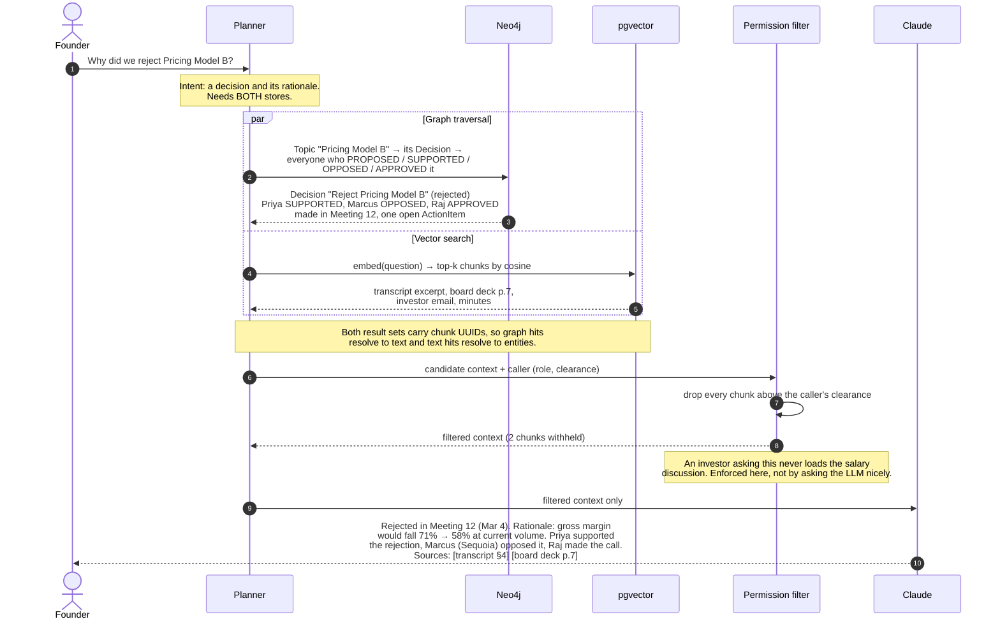
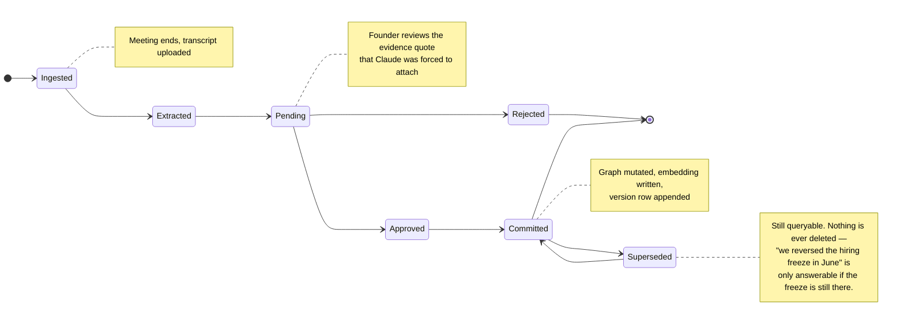

# Meridian — Architecture

## System overview

```mermaid
flowchart LR
    subgraph SRC["Sources"]
        direction TB
        S1["Board decks"]
        S2["Meeting transcripts"]
        S3["Emails and memos"]
        S4["Contracts"]
    end

    ING["<b>1. Ingestion</b><br/>parse → dedupe by hash → chunk"]

    EXT["<b>2. Extraction — Claude Opus</b><br/>entities: Person, Decision, Meeting,<br/>Topic, ActionItem, Metric<br/>edges: APPROVED, OPPOSED, SUPERSEDES<br/><i>every edge carries a verbatim quote</i>"]

    subgraph STORE["3. Storage"]
        direction TB
        GRAPH[("<b>Neo4j</b><br/>knowledge graph<br/><i>how are these related?</i>")]
        PG[("<b>Postgres + pgvector</b><br/>raw docs · embeddings<br/>RBAC · version history<br/><i>what is similar?</i>")]
    end

    subgraph RET["4. Retrieval"]
        direction TB
        PLAN["Planner<br/><i>graph? vector? both?</i>"]
        SEARCH["Graph traversal ‖ Vector search"]
        PERM["<b>PERMISSION FILTER</b><br/>runs BEFORE merge"]
        MERGE["Merge context"]
        PLAN --> SEARCH
        SEARCH --> PERM
        PERM --> MERGE
    end

    LLM["<b>5. Claude</b><br/>grounded answer + citations"]
    USER(["Founder<br/><i>Why did we reject Pricing Model B?</i>"])
    APPROVE["<b>Human Approval Queue</b><br/>the LLM proposes, a human approves<br/><i>the AI never writes to memory directly</i>"]

    SRC --> ING
    ING --> EXT
    EXT -.-> APPROVE
    APPROVE == "approved writes only" ==> GRAPH
    APPROVE ==> PG
    GRAPH <-. "<b>shared chunk UUID</b><br/>the bridge" .-> PG
    GRAPH --> PLAN
    PG --> PLAN
    MERGE --> LLM
    LLM --> USER
    USER -.-> PLAN

    classDef store fill:#e8f0f7,stroke:#4a6fa5,stroke-width:2px
    classDef danger fill:#fdeaea,stroke:#c0392b,stroke-width:3px
    classDef human fill:#fdf3e0,stroke:#d68910,stroke-width:2px
    classDef ai fill:#eaf4f0,stroke:#2e8b7a,stroke-width:2px

    class GRAPH,PG store
    class PERM danger
    class APPROVE,USER human
    class EXT,LLM ai
```

**The bridge is the thesis.** A chunk row in Postgres and its `(:Chunk)` node in Neo4j share one UUID. So a semantic hit can traverse into the graph, and a graph traversal can pull back the exact paragraph that proves it. Neither store alone can do this:

| Store | Answers | Cannot answer |
|---|---|---|
| Postgres + pgvector | "What text is semantically similar?" | "Who approved this, and in which meeting?" |
| Neo4j | "How are these entities related?" | "What does this 20-page PDF actually say?" |

---

## Retrieval: "Why did we reject Pricing Model B?"

**Why the permission filter sits where it does.** Filtering *after* retrieval means the forbidden text was already loaded, ranked, and sitting in memory next to the prompt — one bug away from the context window. Filtering *before* means it was never read. The PRD asks for role-based access control over confidential board material; this is the only placement that actually delivers it.

---

## Memory update — the AI proposes, a human disposes

Nothing here is destructively updated. A superseded decision stays in the graph with a `SUPERSEDES` edge pointing at it.

This is also the project's answer to **PRD Open Question #3** — *"How much autonomy should AI have before requiring founder approval?"* Our answer: **none for writes.** Read freely, propose freely, mutate never.
